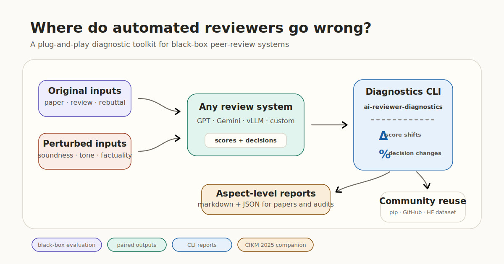

# Where Do LLMs Go Wrong? Diagnosing Automated Peer Review

[](https://github.com/JiataoLi/where-do-llms-go-wrong/actions/workflows/smoke-test.yml)
[](https://pypi.org/project/ai-reviewer-diagnostics/)
[](https://doi.org/10.1145/3746252.3761274)
[](https://huggingface.co/datasets/jiataoli/ai-reviewer-diagnostic-data)
[](LICENSE)
[](pyproject.toml)

A pip-installable diagnostic toolkit for black-box evaluation of automated peer-review systems under controlled aspect-guided perturbations.

Use it as a community evaluation tool: run any automated review system on paired original/perturbed paper, review, or rebuttal inputs; export scores or decisions; then generate aspect-level reports measuring sensitivity to soundness, presentation, contribution, tone, factuality, completeness, and recommendation perturbations.



Companion code, prompts, examples, and reproducibility notes for the CIKM 2025 paper:

> **Where Do LLMs Go Wrong? Diagnosing Automated Peer Review via Aspect-Guided Multi-Level Perturbation**  
> Jiatao Li, Yanheng Li, Xinyu Hu, Mingqi Gao, Xiaojun Wan. CIKM 2025.  
> DOI: https://doi.org/10.1145/3746252.3761274

If this repository helps your research, please cite the paper. Copy-paste BibTeX is below and in [`CITATION.bib`](CITATION.bib); GitHub citation metadata is in [`CITATION.cff`](CITATION.cff).

## 30-second quickstart

Install the diagnostic CLI from PyPI and run the toy report. This path needs no API keys, GPUs, model downloads, or companion dataset.

```bash
python -m pip install ai-reviewer-diagnostics
ai-reviewer-diagnostics --demo --output-md outputs/demo_diagnostic_report.md
```

If you want the latest GitHub version before a PyPI release catches up:

```bash
python -m pip install "git+https://github.com/JiataoLi/where-do-llms-go-wrong.git"
```

Expected package demo output:

```text
Compared 1 condition pair(s).
Wrote outputs/demo_diagnostic_report.md
```

For a repo checkout:

```bash
git clone https://github.com/JiataoLi/where-do-llms-go-wrong
cd where-do-llms-go-wrong
make quickstart
make demo-report
```

Expected checkout quickstart output:

```text
AI-reviewer diagnostic release quickstart: OK
Validated 1 chat example(s), 3 OpenReview note(s).
Prompt rows: base=9, perturb=7.
Wrote outputs/quickstart/quickstart_summary.json
```

`make quickstart` validates the repo layout, example schemas, prompt files, and citation metadata, then writes a tiny demo artifact under `outputs/quickstart/`. `make demo-report` exercises the same packaged report engine exposed as `ai-reviewer-diagnostics`. These are format/schema demos, not model results.

## What you can reuse

| Goal | Start here | Requires |
| --- | --- | --- |
| Check that the repo is healthy | `make quickstart` | Python only |
| Run the API-free code smoke test | `uv sync && uv run make smoke-test` | lightweight Python deps |
| Generate a toy diagnostic report | `make demo-report` or `ai-reviewer-diagnostics ...` | Python only |
| Reuse the prompt templates | [`prompts/`](prompts/) | none |
| Run API-based model inference | [`scripts/run_openrouter.py`](scripts/run_openrouter.py), [`scripts/run_gemini.py`](scripts/run_gemini.py) | API key |
| Run local model inference | [`scripts/run_vllm.py`](scripts/run_vllm.py) | GPU + vLLM |
| Evaluate a new review system's outputs | `ai-reviewer-diagnostics` / [`ai_reviewer_diagnostics`](ai_reviewer_diagnostics/) | JSONL outputs with shared `id` fields |
| Inspect released artifacts | [`docs/DATA.md`](docs/DATA.md) + Hugging Face dataset | `huggingface_hub` |
| Recreate analysis tables/figures | [`analysis/`](analysis/) + [`docs/REPRODUCIBILITY.md`](docs/REPRODUCIBILITY.md) | dataset + analysis deps |

## Command map

| Command | Purpose |
| --- | --- |
| `ai-reviewer-diagnostics --demo --output-md outputs/demo.md` | Verify the pip-installed CLI with bundled toy fixtures. |
| `ai-reviewer-diagnostics --baseline base.jsonl --perturbed pert.jsonl --condition paper/soundness --output-md report.md` | Diagnose one baseline/perturbed pair from your own system. |
| `ai-reviewer-diagnostics --scores-dir ai-reviewer-diagnostic-data/data/annotation_scores --output-md report.md` | Summarize all paired score files in the released dataset format. |
| `make quickstart` | Check a repo checkout without installing dependencies. |
| `make smoke-test` | Run the API-free repository test suite. |

## Integrate your own review system

The toolkit only requires JSONL outputs with shared `id` values. Start with [`docs/INTEGRATIONS.md`](docs/INTEGRATIONS.md) for schema examples, custom score fields, directory mode, and common pitfalls.

## Dependencies

Dependencies and package metadata are managed in [`pyproject.toml`](pyproject.toml). The install exposes two console commands, `ai-reviewer-diagnostics` and the shorter alias `ai-reviewer-report`. Analysis and vLLM dependencies are optional extras.

```bash
uv sync                    # default runtime dependencies
uv sync --extra analysis   # pandas/numpy/scipy plotting stack
uv sync --extra vllm       # optional local GPU inference stack
```

If you do not use uv, the pip-compatible fallback is:

```bash
python -m pip install -e .
python -m pip install -e ".[analysis]"
python -m pip install -e ".[vllm]"
ai-reviewer-diagnostics --help
```

## API-free smoke test

```bash
uv sync
uv run make smoke-test
```

This compiles Python files, validates example JSON, checks all inference runners in `--validate-only` mode, and runs the OpenReview-cleaner fixture. Generated files go under `outputs/` and can be removed with:

```bash
make clean
```

## Dataset

Large artifacts are hosted separately on Hugging Face so the GitHub repo stays lightweight:

```text
https://huggingface.co/datasets/jiataoli/ai-reviewer-diagnostic-data
```

Download and inspect:

```bash
uv run hf download jiataoli/ai-reviewer-diagnostic-data \
  --repo-type dataset \
  --local-dir ai-reviewer-diagnostic-data
uv run python scripts/summarize_release_data.py --data-dir ai-reviewer-diagnostic-data/data
```

Expected summary starts with file count, total size, file types, JSONL row counts, and largest files. See [`docs/DATA.md`](docs/DATA.md) for schema and naming notes.

## Diagnostic toolkit workflow

To evaluate a new automated review system, export its baseline and perturbed outputs as JSONL with a shared `id` field and score/decision fields:

```json
{"id":"paper_001","overall_score":8,"soundness_score":4,"final_decision":"Accept as Poster"}
```

Then generate an aspect-level report:

```bash
make demo-report
# or, for your own system outputs:
uv run ai-reviewer-diagnostics \
  --baseline outputs/my_system_baseline.jsonl \
  --perturbed outputs/my_system_soundness_perturbed.jsonl \
  --condition paper/soundness \
  --output-md reports/my_system_soundness_report.md \
  --output-json reports/my_system_soundness_report.json
```

The report summarizes score deltas, decision-change rates, and top decision transitions. If you use the public dataset score-file naming convention, run directory mode:

```bash
uv run ai-reviewer-diagnostics \
  --scores-dir ai-reviewer-diagnostic-data/data/annotation_scores \
  --output-md reports/released_scores_report.md
```

## Common commands

### OpenAI-compatible / OpenRouter inference

```bash
export OPENROUTER_API_KEY=***
uv run python scripts/run_openrouter.py \
  --input examples/example.json \
  --output outputs/model_outputs.jsonl \
  --model mistralai/mistral-small-3.1-24b-instruct \
  --base-url https://openrouter.ai/api/v1 \
  --api-key-env OPENROUTER_API_KEY \
  --workers 1
```

### Gemini inference

```bash
export GEMINI_API_KEY=***
uv run python scripts/run_gemini.py \
  --input examples/example.json \
  --output outputs/gemini_outputs.jsonl \
  --model gemini-2.0-flash \
  --workers 1
```

### Optional local vLLM inference

`vllm` is intentionally kept out of the default install because it depends on your CUDA, PyTorch, and GPU setup.

```bash
uv sync --extra vllm
uv run python scripts/run_vllm.py \
  --input examples/example.json \
  --output outputs/vllm_outputs.jsonl \
  --model-path Qwen/Qwen2.5-72B-Instruct \
  --tensor-parallel-size 8 \
  --limit 1
```

### Clean an OpenReview export

```bash
uv run python scripts/clean_openreview.py \
  --input examples/openreview_comments_minimal.json \
  --output outputs/openreview_conversations.json \
  --forum-id forum_example \
  --print-text
```

For your own data, replace `examples/openreview_comments_minimal.json` with an OpenReview comments export.

## Repository layout

```text
ai_reviewer_diagnostics/ # pip-installable diagnostic report package
scripts/              # wrappers and reusable CLIs: quickstart, inference, preprocessing, data summary
analysis/             # analysis scripts for released annotation-score artifacts
examples/             # tiny runnable fixtures for quickstart, smoke tests, and report generation
prompts/              # curated machine-readable prompt templates
  base_prompt.jsonl
  perturb_prompt.jsonl
data/README.md        # pointer to the external Hugging Face dataset
docs/                 # getting-started, data, and reproducibility notes
paper/README.md       # DOI, ACM PDF link, and citation pointer
CITATION.bib          # BibTeX citation
CITATION.cff          # GitHub citation metadata
CONTRIBUTING.md       # community contribution guide
MANIFEST.md           # full release inventory
```

## Reproducibility path

The release is organized in tiers so users can get value from the public code, prompts, examples, and released artifacts:

1. **Immediate check:** `make quickstart` validates layout and schemas with Python only.
2. **Code smoke test:** `make smoke-test` checks scripts without API calls or GPUs.
3. **Artifact inspection:** download the Hugging Face dataset and run `summarize_release_data.py`.
4. **Model inference:** run OpenRouter, Gemini, or vLLM wrappers on your own prompt batches.
5. **Diagnostic report:** compare a system's baseline and perturbed outputs with `ai-reviewer-diagnostics`.
6. **Analysis:** use `analysis/` scripts on downloaded score artifacts.

See [`docs/GETTING_STARTED.md`](docs/GETTING_STARTED.md) and [`docs/REPRODUCIBILITY.md`](docs/REPRODUCIBILITY.md) for the longer guide.

## Community contributions

Bug reports, integration requests, and metric ideas are welcome. Use the GitHub issue templates for reproducible CLI bugs, new automated-review-system integrations, or report-metric proposals. Pull requests should keep the default install lightweight and API-free smoke tests passing; see [`CONTRIBUTING.md`](CONTRIBUTING.md).

## Citation

```bibtex
@inproceedings{li2025where,
  title     = {Where Do LLMs Go Wrong? Diagnosing Automated Peer Review via Aspect-Guided Multi-Level Perturbation},
  author    = {Li, Jiatao and Li, Yanheng and Hu, Xinyu and Gao, Mingqi and Wan, Xiaojun},
  booktitle = {Proceedings of the 34th ACM International Conference on Information and Knowledge Management (CIKM '25)},
  year      = {2025},
  publisher = {ACM},
  doi       = {10.1145/3746252.3761274},
  url       = {https://doi.org/10.1145/3746252.3761274}
}
```

## Documentation map

- [`docs/GETTING_STARTED.md`](docs/GETTING_STARTED.md): shortest path for a new user.
- [`docs/DATA.md`](docs/DATA.md): dataset contents, schemas, naming glossary, and rights notes.
- [`docs/REPRODUCIBILITY.md`](docs/REPRODUCIBILITY.md): tiered reproduction guide.
- [`docs/INTEGRATIONS.md`](docs/INTEGRATIONS.md): connect a new automated-review system.
- [`scripts/README.md`](scripts/README.md): CLI map and examples.
- [`analysis/README.md`](analysis/README.md): analysis script guide.
- [`prompts/README.md`](prompts/README.md): prompt reuse notes.
- [`CONTRIBUTING.md`](CONTRIBUTING.md): issue/PR workflow for community contributions.
- [`MANIFEST.md`](MANIFEST.md): release inventory.

## Release status

The GitHub repository contains code, curated prompts, docs, examples, citation metadata, and pointers to the paper/data. The ACM paper PDF is linked from [`paper/README.md`](paper/README.md) rather than redistributed here. Code is MIT licensed in [`LICENSE`](LICENSE); the dataset is hosted separately on Hugging Face under its dataset-card terms.

## Contact

Open a GitHub issue in the public repository for questions, reuse requests, or reproduction problems.
